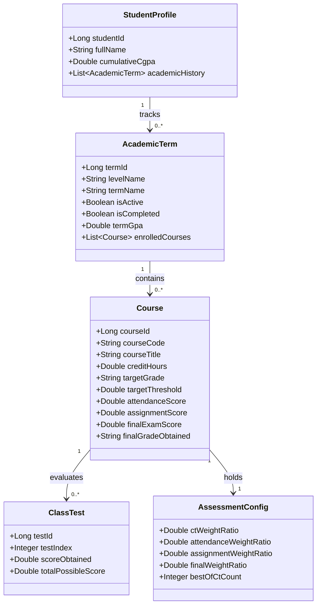
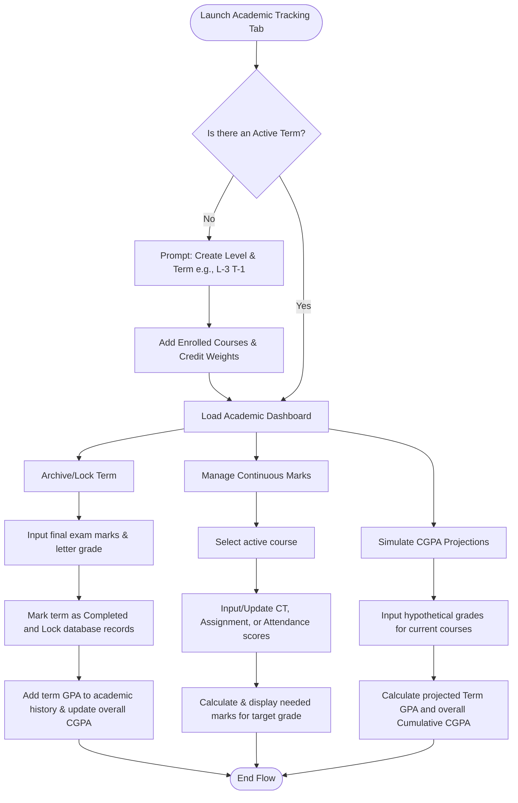

# 🎓 Academic Tracking & CGPA Management Design Guide

This guide details the architectural design, business logic, data models, and user flows for the **Academic Tracking and CGPA Management** module. It focuses on technology-agnostic business logic, calculations, and interface interactions.

---

## 🗺️ High-Level Roadmap

The feature is planned to be implemented incrementally through the following logical phases:

### Module 1: Term & Subject Setup
- **Phase 1: Active Academic State Configuration**
  - **Step 1.1:** Setup level/year/term state controls (e.g., defining Level 3 Term 1 as "Active").
  - **Step 1.2:** Implement course enrollment forms to capture course codes, names, and credit weighting.
- **Phase 2: Grade Policy Engine**
  - **Step 2.1:** Define a configurable grading scale mapping percentage bounds to Grade Point values (e.g. 80% = 4.00, 70% = 3.50).

### Module 2: Continuous Assessment & Target Tracking
- **Phase 1: Assessment Score Cards**
  - **Step 1.1:** Build interfaces to log Class Tests (CTs), homework, attendance, and mid-term marks.
  - **Step 1.2:** Configure grading weights (e.g., CT = 20%, Attendance = 10%, Final Exam = 70%).
- **Phase 2: Target Calculator Engine**
  - **Step 2.1:** Implement the "Needed Marks" algorithm to display target thresholds for upcoming final written exams.

### Module 3: CGPA Dashboard & Simulator
- **Phase 1: Academic Summary & Projections**
  - **Step 1.1:** Compute term GPA and overall CGPA from completed semesters.
  - **Step 1.2:** Create interactive calculators where students input simulated grades to project CGPA shifts.
- **Phase 2: Historical Term Archive**
  - **Step 2.1:** Implement onboarding/migration flows enabling students to input historical term summaries directly to seed initial CGPA.

---

## 🧠 Logical Descriptions

### 1. Simple vs. Technical Breakdown
- **Simple Description:** 
  For a student, this section answers three questions: 
  * "Where do I stand right now in my classes?"
  * "What score do I need in the final exam to get an A+ in this course?"
  * "If I get an A in my current courses, what will my overall graduation CGPA be?"
- **Technical Description:** 
  The backend maintains the data relationships between a student's profile, their past academic history (historical terms), active terms, courses, assessment weights, and individual test records. The frontend displays this data in real-time, executing local simulations to project cumulative and term GPA values on changes, while the target grade engine computes needed exam scores dynamically.

---

## 🧮 Core Business Logic & Calculations

### 1. Needed Marks Algorithm
To compute the percentage required in the final written exam to achieve a target letter grade:

1. Let $T$ be the threshold percentage required for the target grade (e.g., $80\%$ for an `A+`).
2. Let $C$ be the current total accumulated marks from continuous assessments:
   $$C = \text{Sum(Best } N \text{ of } M \text{ Class Tests)} + \text{Attendance Score} + \text{Assignment Marks}$$
3. Let $W_{final}$ be the weight percentage allocated to the final written exam (e.g., $70\%$, meaning $0.70$).
4. The required final exam percentage $P_{needed}$ is calculated as:
   $$P_{needed} = \frac{T - C}{W_{final}} \times 100$$
5. **Logic Constraints:**
   - If $P_{needed} \le 0$: Display a success indicator: "Target grade already guaranteed."
   - If $P_{needed} > 100$: Display a warning indicator: "Target grade is mathematically impossible based on current assessment results."

### 2. Term GPA Projection
To compute the predicted Grade Point Average for the active term:
$$GPA_{term} = \frac{\sum_{i=1}^{K} (GP_i \times Credits_i)}{\sum_{i=1}^{K} Credits_i}$$
Where:
- $GP_i$ is the Grade Point (e.g., 3.75) for course $i$.
- $Credits_i$ is the Credit weighting (e.g., 3.0) for course $i$.
- $K$ is the total number of courses in the active term.

### 3. Overall Cumulative CGPA Tracking
To compute the overall cumulative GPA across all completed and projected terms:
$$CGPA_{overall} = \frac{\sum_{j=1}^{T_{all}} (GPA_j \times Credits_{total, j})}{\sum_{j=1}^{T_{all}} Credits_{total, j}}$$
Where:
- $GPA_j$ is the term GPA of semester $j$.
- $Credits_{total, j}$ is the total credits completed in semester $j$.
- $T_{all}$ is the total number of semesters.

---

## 💾 Abstract Data Models

The following UML diagrams describe the entities and relations of the Academic Tracking feature:

---

## 🔄 User Flows

---

## 📝 Summary

1. **Setup:** The student configures their active level, term, and enrolled courses with credit weights.
2. **Assessment:** As continuous assessment scores are recorded, the system calculates target written exam scores to reach target grades.
3. **Simulation:** The interactive simulator lets the student test various scenarios to see how simulated term GPAs affect overall CGPA.
4. **Archiving:** Upon completion of the final exam, the student enters final grades, locks the term, and archives it to update their cumulative GPA history.
